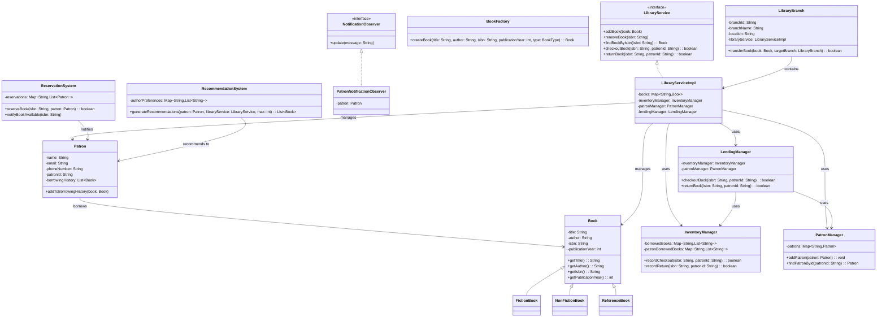

# Library Management System

## Overview
This Library Management System is a Java application designed to help librarians manage books, patrons, and lending processes efficiently. The system demonstrates key Object-Oriented Programming (OOP) concepts, SOLID principles, and design patterns.

## Package Structure
The system is organized into the following packages for better modularity and separation of concerns:

```
librarymanagementsystem/
├── branches/              # Multi-branch support
├── inventory/             # Inventory management
├── lending/               # Lending process management
├── model/                 # Data models (Book, Patron, etc.)
├── notifications/         # Notification system (Observer pattern)
├── patron/                # Patron management
├── recommendations/       # Recommendation engine
├── reservation/           # Book reservation system
├── services/              # Service interfaces
│   └── impl/             # Service implementations
├── utils/                 # Utility classes (Factory pattern)
└── LibraryManagementSystemDemo.java  # Demo application
```

## Features

### Core Functionality
1. **Book Management**
   - Add, remove, and update books
   - Search books by title, author, or ISBN
   - Support for different book types (Fiction, Non-Fiction, Reference)

2. **Patron Management**
   - Add and update patron information
   - Track patron borrowing history

3. **Lending Process**
   - Book checkout and return functionality
   - Track available and borrowed books

### Advanced Features
1. **Multi-branch Support**
   - Support for multiple library branches
   - Book transfer between branches

2. **Reservation System**
   - Book reservation for patrons
   - Notification system for when reserved books become available

3. **Recommendation System**
   - Book recommendations based on patron borrowing history
   - Author-based and popularity-based recommendations

## Design Principles

### Object-Oriented Programming (OOP)
- **Encapsulation**: All classes encapsulate their data and provide controlled access through methods
- **Inheritance**: Specialized book types inherit from the base Book class
- **Polymorphism**: Different book types can be treated as Book objects
- **Abstraction**: Complex operations are abstracted through interfaces

### SOLID Principles
1. **Single Responsibility Principle**: Each class has a single, well-defined purpose
2. **Open/Closed Principle**: Classes are open for extension but closed for modification
3. **Liskov Substitution Principle**: Subclasses can substitute their parent classes
4. **Interface Segregation Principle**: Interfaces are focused and specific
5. **Dependency Inversion Principle**: High-level modules depend on abstractions

### Design Patterns
1. **Factory Pattern**: BookFactory for creating different types of books
2. **Observer Pattern**: Notification system for the reservation feature
3. **Strategy Pattern**: Different recommendation algorithms could be implemented

### Data Structures
- HashMap for efficient lookups
- ArrayList for dynamic collections
- Streams for functional data processing

## Class Diagram

